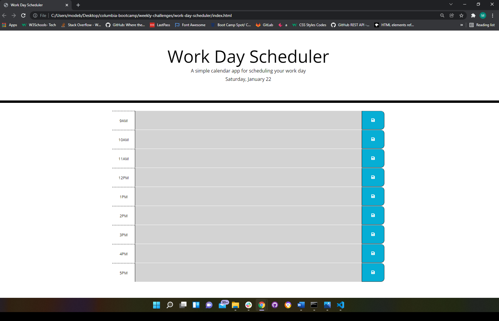

# Work Day Scheduler Starter Code

## Description:
This is a daily planner web application that loops through standard business hours (9AM-5PM) of the day that the user opens the app. Each time block is color coded to show whether it is in the past, present, or future. This app allows the user to enter new events by clicking on the desired time block and typing text for the event. Events are saved in the local storage by clicking the save button to the right of the time block.

## Screenshot

## Link
https://mubohouston.github.io/work-day-scheduler/
